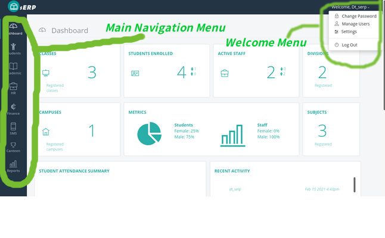
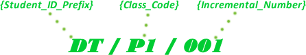
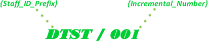

Getting Started
###############

This section provides useful and important information required to get you up and running. It covers the basics of the software, as well as the steps required to get your sERP installation ready for use.

.. |drop_arrow| image:: ../images/drop-arrow.png

.. _setup_layout:

Layout & Overview
*****************

.. _setup_initial:

Initial Setup
*************

This section covers initial steps needed to prepare your sERP installation for first use. These steps should be performed in order to begin using sERP.

Change default password
=======================

Your sERP welcome email contains an admin password required to log in to sERP. You should ideally change this password.

.. hint::

	Check out our :ref:`users_change_password` guide for more information.

.. note::

	We recommend that your password meets the following criteria:

	* Minimim of 8 characters (required)
	* A mixture of both uppercase and lowercase letters
	* A mixture of letters and numbers
	* Inclusion of at least one special character, e.g., ! @ # ? ]

.

.. _setup_details:

Configure School Details
========================

Enter basic information about your school. This information is generally used across different sections and modules in the sERP ecosystem.

.. hint::

	Check out our :ref:`settings_general` configuration guide for more information.

.

.. _setup_student_prefix:

Configure Student ID Prefix
===========================

sERP utilizes a combination of the student ID prefix and the class code when generating student IDs. The student ID prefix has to be configured in order for sERP to be able to auto generate student IDs during registration.

The student ID format is illustrated below:

To configure the student ID prefix:

1. From the :ref:`welcome menu <setup_layout>`, click on "Settings"
2. From the general settings page, click wrench (|wrench_icon|) icon next to "Student ID Prefix"
3. In the "Student ID Prefix", enter the value you wish to use as the student ID prefix
4. Click "Save"

.

.. _setup_staff_prefix:

Configure Staff ID Prefix
=========================

The staff ID prefix is required to auto generating staff IDs in sERP. The staff ID format is illustrated below:

To configure the staff ID prefix:

1. From the :ref:`welcome menu <setup_layout>`, click on "Settings"
2. From the general settings page, click wrench (|wrench_icon|) icon next to "Staff ID Prefix"
3. In the "Staff ID Prefix", enter the value you wish to use as the staff ID prefix
4. Click "Save"

.

.. _setup_campuses:

Add Campuses/Locations
======================

1. From the :ref:`main navigation menu <setup_layout>`, go to Students -> Campuses
2. From the "Add Campus" pane, enter the name of campus next to "Campus Name"

	.. tip::
		You can add multiple campuses at a go by clicking on the (**+**) icon
3. Click on "Add Campus/es"

.

.. _setup_divisions:

Add Divisions
=============

1. From the :ref:`main navigation menu <setup_layout>`, go to Academic -> Divisions
2. From the "Add Division" pane, enter the name of division next to "Division Name"

	.. tip::
		You can add multiple divisions at a go by clicking on the (**+**) icon
3. Click on "Add Division/s"

.

.. _setup_calendar:

Configure Default Academic Calendar
===================================

The default academic calendar setting informs sERP about the current academic term/year. The default academic calendar needs to be configured for both the "Trimester" and "Semester" categories.

.. hint::

	Check out our :ref:`settings_calendar` configuration guide for more information.

.

.. _setup_classes:

Add Classes
===========

1. From the :ref:`main navigation menu <setup_layout>`, go to Academic -> Classes
2. Click the drop down arrow ( |drop_arrow| ) in the "Add Class" pane to reveal the form options
3. From the "Add Class" pane, enter the following:

	.. note::
		* **Academic Calendar**: select the academic calendar category for the class
		* **Class Name**: enter the name of the class as you'd like it to appear
		* **Campus**: select the campus/location where this class belongs
		* **Division**: select the division this class belongs
		* **Class Teacher**: select and assign a class teacher for this class. *(This requires a user account to have been created, and assigned to a staff in sERP)*
		* **Class Code**: enter a code for this class. (*This is required for* :ref:`student ID generation <setup_student_prefix>`)

	.. tip::
		You can add multiple classes at a go by clicking on the drop down arrow ( |drop_arrow| ) in the "Quick Add Class(es)" pane

4. Click on "Add Class"

.

.. _setup_departments:

Add Staff Departments
=====================

1. From the :ref:`main navigation menu <setup_layout>`, go to HR -> Departments
2. From the "Add Department" pane, enter the name of the department in the box next to "Department Name"

	.. hint::
		You can add multiple departments at a go by clicking on the (+) icon

3. Click "Add Department/s"

.

.. _setup_staff_types:

Add Staff Designation
=====================

Staff types or designation represent the posts/position of staff in your school, and is required when adding staff information in sERP.

1. From the :ref:`welcome menu <setup_layout>`, click on "Settings"
2. Next, click on "HR Settings"
3. From the HR Settings page, click the wrench (|wrench_icon|) icon next to "Staff Types Added"
4. In the box next to "Staff Grade/Post", enter the staff position/grade
5. Click "Add Staff Type"

.

.. _setup_fee_types:

Add Fee Types
=============

Fee types represent billable items that appear on student bills. This is required when :ref:`configuring fees <finance_set_fees>`, and also when :ref:`preparing student bills <finance_prepare_bill>`.

1. From the :ref:`welcome menu <setup_layout>`, click on "Settings"
2. Next, click on "Finance Settings"
3. From the Finance Settings page, click the wrench (|wrench_icon|) icon next to "Fees Types Added"
4. From the "Add Fees Type" pane, enter the name of the billable item in the box next to "Fee Type"

	.. hint::
		You can add multiple fee types at a go by clicking on the (+) icon

5. Click "Add"