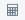
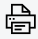

Academic Module
###############

This section of our guide covers the various tools and features available in sERP for managing academics related data; from general academic information, to student performance assessment.

.. |edit_icon| image:: ../images/pencil.png
.. |delete_icon| image:: ../images/trash.png
.. |drop_arrow| image:: ../images/drop-arrow.png

.. |info_icon| image:: ../images/info.png

.. _academic_classes:

Classes
*******

This section allows you manage all information related to your school's classes in sERP. The classes section can be accessed from the :ref:`main navigation menu <setup_layout>` by going to Academic -> Classes.

Add Class
=========

1. Click the drop down arrow ( |drop_arrow| ) in the "Add Class" pane to reveal the form options
2. From the "Add Class" pane, enter the following:

	.. note::
		* **Academic Calendar**: select the academic calendar category for the class
		* **Class Name**: enter the name of the class as you'd like it to appear
		* **Campus**: select the campus/location where this class belongs
		* **Division**: select the division this class belongs
		* **Class Teacher**: select and assign a class teacher for this class. *(This requires a user account to have been created, and assigned to a staff in sERP)*
		* **Class Code**: enter a code for this class. (*This is required for* :ref:`student ID generation <setup_student_prefix>`)

	.. tip::
		You can add multiple classes at a go by clicking on the drop down arrow ( |drop_arrow| ) in the "Quick Add Class(es)" pane

3. Click on "Add Class"

View Class Summary & Roster
===========================

From the "Existing Class List" pane, locate and click on the name of the class to display the class summary and list of students enrolled in that class. You may also export the student list.

.. _academic_edit_class:

Modifying Class Data
====================

1. From the "Existing Class List" pane, click on edit class (|edit_icon|) in the "Action" column for the class
2. Modify the following:

	.. note::
		* **Academic Calendar**: select the academic calendar category for the class
		* **Class Name**: enter the name of the class as you'd like it to appear
		* **Campus**: select the campus/location where this class belongs
		* **Group**: select the class group to add this class to
		* **Division**: select the division this class belongs
		* **Class Teacher**: select and assign a class teacher for this class. *(This requires a user account to have been created, and assigned to a staff in sERP)*
		* **Class Prefect**: select and assign class prefect for this class from roster
		* **Class Code**: enter a code for this class (*This is required for* :ref:`student ID generation <setup_student_prefix>`). Changes have no effect on existing student ID
		* **SBA Configuration**: specify the :ref:`SBA configuration <settings_sba>` to be used for this class
		* **SBA Assign. Staff**: select a list of staff/teachers who can record marks for student assessment in this class

3. Click "Save"

Delete Class
=============

1. From the "Existing Class List" pane, click on "Delete Class" (|delete_icon|) in the "Action" column for the class
2. From the confirmation dialog box, click to confirm the deletion

.. warning::
	Deleting data is an irreversible process

.

.

.. _academic_class_groups:

Class Groups
************

Class Groups in sERP allow you combine various classes into one unit. For example, a school with classes JHS 1A, JHS 1B and JHS 1C may choose to have a class group named "JHS", which includes all of these different classes. This enables you search and list students in a particular group, as well as prepare :ref:`combined progress reports <academic_combined_reports>` for that unit.

The class groups section can be accessed from the :ref:`main navigation menu <setup_layout>` by going to Academic -> Class Groups.

Adding a class group
====================

1. From the "Add Group" pane, enter the name of class group next to "Class Group Name"

	.. tip::
		You can add multiple class groups at a go by clicking on the (**+**) icon

3. Click on "Add Group/s"

Deleting a class group
======================

1. From the "Added Class Groups" pane, click on delete (|delete_icon|) in the "Action" column for the class group
2. From the confirmation dialog box, click to confirm the deletion

.. note::
	You may only delete a class that doesn't have any classes assigned to it

.. warning::
	Deleting data is an irreversible process

.

.

.. _academic_subjects:

Subjects
********

Subjects can be managed from the :ref:`main navigation menu <setup_layout>` by going to Academic -> Subjects.

Adding subjects
===============

From the "Quick Add" pane:

1. Enter the name of the subject in the box next to "Subject Name"
2. Enter the subject code in the box next to "Code"

	.. tip::
		You can add multiple subjects at a go by clicking on the (**+**) icon

.. _academic_edit_subject:

Modifying a subject
===================

1. From the "Subjects" pane, click on edit (|edit_icon|) in the "Action" column for the subject
2. Enter the following:

	* **Subject Name**: the name of the subject as it should appear in sERP and on relevant documents
	* **Subject Code**: a shortened code for the subject
	* **SBA Assign. Staff**: select staff who should have access to record SBA marks for this subject

3. Click on "Save"

Deleting a subject
==================

1. From the "Subjects" pane, click on delete (|delete_icon|) in the "Action" column for the subject
2. From the confirmation dialog box, click to confirm the deletion

.. warning::
	Deleting data is an irreversible process

.

.

.. _academic_divisions:

Divisions
*********

From the :ref:`main navigation menu <setup_layout>`, go to Academic -> Divisions

Adding a new division
=====================

1. From the "Add Division" pane, enter the name of division next to "Division Name"

	.. tip::
		You can add multiple divisions at a go by clicking on the (**+**) icon

2. Click on "Add Division/s"

.

.

.. _academic_calendar:

Calendar
********

The calendar section (not to be confused with the :ref:`Academic Calendar Setting <settings_calendar>`) enables you to record upcoming events. sERP can provide alerts and reminders for events to help keep you up to speed.

The calendar section can be accessed from the :ref:`main navigation menu <setup_layout>` by going to Academic -> Calendar

Adding Event Types
==================

1. Click the drop down arrow ( |drop_arrow| ) in the "Add Event Type" pane to reveal the form options
2. Enter the event type in the box next to "Event Type"
3. Click "Add Event Type"

Adding an Event
===============

1. From the "Add Event" pane, enter the following information:

	* **Event Type**: select the type of event from the list of added event types
	* **Event Name**: enter a name for the event
	* **Description**: optionally, enter a description for the event
	* **Start Date**: enter a start date for the event
	* **End Date**: enter an end date for the event

2. Click "Add Event"

Modifying an event
==================

1. From the "Events" pane, click on edit (|edit_icon|) in the "Action" column for the event
2. Enter the new values for the requested information above
3. Click on "Save Event"

Deleting an event
=================

1. From the "Events" pane, click on delete (|delete_icon|) in the "Action" column for the event
2. From the confirmation dialog box, click to confirm the deletion

.. warning::
	Deleting data is an irreversible process

.

.

.. _academic_notes:

Notes
*****

sERP enables authorized staff draft notes and upload files, which can later be viewed/downloaded by students or parents via their respective portals.

The notes section can be accessed from the :ref:`main navigation menu <setup_layout>` by going to Academic -> Notes.

Adding a note
=============

1. From the "Add Note" pane, supply the following information:

	* **Class**: select the class which the note is being added for. Only students and parents of students in this class can view the note
	* **Subject**: select the applicable subject for the note
	* **Topic**: a topic for the note for easy identification
	* **Notes**: enter the text for your note
	* **Attach Document**: select Word, Excel, PDF or txt file to be added to the note

2. Click "Add Notes"

.

.

.. _academic_year_groups:

Year Groups
***********

Create and manage groupings for various outgoing sets/batches. Year groups are particularly useful for retrieving information pertaining to past students, but can also be used in other arears within the sERP ecosystem.

The year groups section can be accessed from the :ref:`main navigation menu <setup_layout>` by going to Academic -> Year Groups.

Adding a year group
===================

1. From the "Add Group" pane, enter the name of year group next to "Year Group Name"

	.. tip::
		You can add multiple year groups at a go by clicking on the (**+**) icon

3. Click on "Add Group/s"

Deleting a year group
=====================

1. From the "Added Year Groups" pane, click on delete (|delete_icon|) in the "Action" column for the year group
2. From the confirmation dialog box, click to confirm the deletion

.. warning::
	Deleting data is an irreversible process

.

.

.. _academic_sba:

SBA
***

This section enables authorized users record student assessment for their respective classes. The SBA section can be accessed from the :ref:`main navigation menu <setup_layout>` by going to Academic -> SBA.

.. note::
	
	* SBA Configuration data is required to be able to record assessment. Each class would've had to have been assigned a SBA configuration. See our :ref:`academic_edit_class` guide for more information
	* Staff would need to have been assigned to both the class and subject in order to be able to record assessment for either. See our :ref:`academic_edit_class` and :ref:`academic_edit_subject` guides for more information

Recording Student Assessment
============================

1. Select the following information:
	
	* **Class**: the class you are recording SBA for
	* **Subject**: the subject you are recording SBA for
	* **Academic Year**: the academic year you are recording SBA for
	* **Term/Semester**: depending on class, the term or semester you are recording SBA for

2. Click on "Load" to retreive list of students in the selected class

3. From the "Continuous Assesment" pane, perform the following for each listed student:

	* From the "Class Work" column, enter the marks obtained by the student for each class work (A1, A2, A3, etc) in the respective boxes provided
	* Enter the marks obtained by the student in the final examination in the box under "Exam Score 100%"
	* Click on the compute (|calculator_icon|) link to scale marks and calculate the student's total score

4. Once all students have been assessed, click on "Save Report" to save/update

.

.

.. _academic_terminal_reports:

Progress Reports
****************

This section prepares academic reports for each students at the end of each term/semester. The progress reports section can be accessed from the :ref:`main navigation menu <setup_layout>` by going to Academic -> Progress Reports.

Generating Reports
==================

1. Select the following report criteria:

	* **Show**: select whether to generate report for single student or entire class
	* **Class**: if class is selected above, select the class you wish to generate report for
	* **Student**: if student is selected above, enter the :ref:`Student ID <student_details>` of the student you wish to generate report for
	* **Academic Year**: select the academic year you wish to generate report for
	* **Term/Semester**: select term/semester you wish to generate report for

2. Click "List Students"

3. From the "Students" pane, select the student(s) you wish to generate report for by checking the box next to the students name

	.. note::
		Only students who have marks entered for the selected academic year and term/semester will be listed

4. Click "Generate Report" to generate/view printable progress report for the selected student(s), or "Go to SMS" to send report via SMS instead

.. _academic_report_data:

Recording Report Data
=====================

Once a progress report has been generated, you may enter the following information for each student report:

	* **PROMOTED TO/REPEATED IN**: the class the student will be in for the next academic term/semester
	* **ATTENDANCE**: student attendance for the term/semester under assessment. sERP automatically populates this field if :ref:`student attendance <student_attendance>` has been recorded
	* **NEXT SEMESTER BEGINS**: the reopening date for next term/semester. sERP automatically populates this field if :ref:`academic calendar <academic_calendar>` entry exists for the coming term/semester
	* **AGGREGATE**: the students aggregate score for the term/semester
	* **STUDENT'S CONDUCT**
	* **STUDENT'S INTERESTS**
	* **CLASS TEACHER'S/FORM MASTER'S REMARKS**
	* **HOUSE MASTER'S/MISTRESS' REMARKS**
	* **HEAD MASTER'S REMARKS**

Click on "Save Report" to update the information entered, or "Print" to print out the report.

**HEADMASTER'S SIGNATURE**: a dotted line is provided on generated reports for headmaster's signature. sERP automatically appends the image for the :ref:`headmaster's signature <students_edit_campus>` if uploaded

.

.

.. _academic_combined_reports:

Combined Progress Reports
*************************

Progress reports can also be prepared for :ref:`class groups <academic_class_groups>` using the combined progress reports section. This section can be accessed from the :ref:`main navigation menu <setup_layout>` by going to Academic -> Combined Reports.

Generating Combined Reports
===========================

Select the following:

	* **Group**: the :ref:`class group <academic_class_groups>` you wish to generate the report for
	* **Academic Year**: select the academic year you wish to generate report for
	* **Term/Semester**: select term/semester you wish to generate report for

2. Click "List Students"

3. From the "Students" pane, select the student(s) you wish to generate report for by checking the box next to the students name

	.. note::
		Only students who have marks entered for the selected academic year and term/semester will be listed

4. Click "Generate Report" to generate/view printable progress report for the selected student(s), or "Go to SMS" to send report via SMS instead

.

.

.. _academic_correspondence:

Correspondence
**************

This section enables you to create and track outgoing letters using an automatically generated "ref". All letters are appended to a letter head which is automatically generated and formatted by sERP.

The correspondence section can be accessed from the :ref:`main navigation menu <setup_layout>` by going to Academic -> Correspondence.

.. _academic_drafting_correspondence:

Drafting a Correspondence
=========================

1. Click the drop down arrow ( |drop_arrow| ) in the "Add Correspondence" pane to reveal the form options
2. Enter the following:

	* **Address**: address of the addressee (recipient) of the letter
	* **Salutation**: salutation as you wish for it to appear on the letter
	* **Subject**: the subject of the letter
	* **Body**: the introduction and content of the letter
	* **Closing**: complementary close
	* **Signature**: name or designation
	* **Date**: select the correspondence date

3. Click "Add Correspondence"

Viewing and printing a Correspondence
=====================================

1. From the "Previous Correspondences" pane, click on "View Correspondence" (|info_icon|)
2. Click on "Print Correspondence" (|print_icon|)

Modifying a Correspondence
==========================

1. From the "Previous Correspondences" pane, click on "Edit Correspondence" (|edit_icon|)
2. Review and update the information in step 2 of :ref:`academic_drafting_correspondence` above
3. Click "Submit"

Deleting a Correspondence
=========================

1. From the "Previous Correspondences" pane, click on "Delete Correspondence" (|delete_icon|)
2. From the confirmation dialog box, click to confirm the deletion

.. warning::
	Deleting data is an irreversible process

.

.