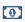

Finance Module
##############

The following sections provides information surrounding the management of financial aspects of sERP.

.. |edit_icon| image:: ../images/pencil.png
.. |delete_icon| image:: ../images/trash.png
.. |info_icon| image:: ../images/info.png

.. _finance_set_fees:

Fees Configuration
******************

sERP offers various options for configuring and managing fees. Fees can be configured for individual students, one or more classes; based on student status and per :ref:`billable item <settings_fee_items>`.

1. From the :ref:`main nagivation menu <setup_layout>`, go to Finance -> Set Fees
2. Select the Academic Year and Term/Semester from the respective drop-down menus
3. Click on "Submit"

Once the term/semester and academic year have been specified, you can then go ahead to configure fees from the "Set Fees" pane as follows:

1. Select criteria

Settings fees by class
======================

	* Select option "One or more classes" from the drop-down menu next to "Set fees for"
	* From the drop-down menu next to "Class(se)", check the classes you wish to configure fees for
	* Select the student status from the drop-down menu next to "Status". You may also select "All Students" to configure fees for all status types

Set fees by individual student
==============================

You can set fees for an individual student which is different from fees set for the rest of the class.

	* Select option "Individual Student" from the drop-down menu next to "Set fees for"
	* From the drop-down menu next to "Student's Class", select the class the student is enrolled in
	* From the drop-down menu next to "Student", select the student

2. Select a billable item from the drop-down menu next to "Fee Item" to configure fees for that item
3. Specify the fee amount for that item
4. Click "Set Fees"

.. tip::

	The above steps need to be performed for each billable item

Deleting set fees
=================

**For Individual Items**

1. From the "Current Fees" pane, click on delete (X) next to the item you wish to remove fees for
2. Confirm deletion of fees

**For Entire Class**

1.  From the "Current Fees" pane, click on "clear set fees for this class" (|delete_icon|) from the "Actions" column for the class
2. Confirm deletion of fees

.. note::

	It isn't advisable to delete set fees if payment has been recorded against the item(s), as this has an effect on student's bill and payment history.

.. warning::
	Deleting data is an irreversible process

.

.. _finance_prepare_bill:

Student Billing
***************

This section covers information about billing management. sERP provides robust and flexible tools for preparing, updating and organizing students' bills. The billing management section can be accessed from the :ref:`main nagivation menu <setup_layout>` by going to Finance -> Prepare Bill.

1. Select billing criteria

Billing entire class
====================

	* Select option "By Class" from the drop-down menu next to "Show"
	* Select the class you wish to prepare bill for from the drop-down menu next to "Class"
	* Select the student status from the drop-down menu next to "Status". You may also select "All Students" to configure fees for all status types

Billing individual student
==========================

	* Select option "By Student" from the drop-down menu next to "Show"
	* Enter the ID of the student you wish to prepare a bill for in the box next to "Student ID"

2. Select Academic Year and Term/Semester from the releant drop-down menu
3. Click "Submit"

.. hint::

	sERP updates and populates the academic calendar period based on the selected class

4. From the "Bill Summary" pane, do one of the following:

	* Click on "Bill Student" from the "Actions" column for the student to prepare/update that student's bill, OR
	* Select one or more students by checking the check box for the student(s) and click "Generate/Update Bills"

Adding Custom Bills
===================

sERP allows you to add up to three (3) extra items to a student's bill, in addition to predefined :ref:`billable items <settings_fee_items>`. This is particularly useful in a scenario where it is required to bill a student for an item that typically wouldn't be added to a students bill.

.. note::

	1. :ref:`Fees <finance_set_fees>` would had to have been set for a class in order to be able to prepare bill for students in that class
	2. Each time any changes are made to the price of billable items, or student financial status, bills would have to be re-prepared/updated in order for student bill to reflect the changes

.

.. _finance_payment:

Payments
********

This section covers information about capturing payments. sERP allows for recording and generating receipts two (2) kinds of payments, namely:

* **Bill payments**: payments against bills that have previously been prepared in sERP
* **Non-bill payments**: payments received for items that haven't necessarily been billed

Bill payments
=============

1. From the :ref:`main nagivation menu <setup_layout>`, go to Finance -> Bill Payment
2. Select the following:

	* **Class**: the class in which the student you are recording payment for is enrolled
	* **Academic Year**: the academic year for which the payment was made
	* **Term/Semester**: the academic term for which the payment was made
	* **Student**: select the student you are recording payment for from the class register

3. Click "Load" to display payment options and retreive student's financial records, which will be displayed in "Student Bill Summary" pane
4. Enter the following:

	* **Amount**: the amount received from the student
	* **Date paid**: the date in which the payment was made. Defaults to current date
	* **Apply to Bille Item(s)**: you may specify whether to apply payment to specific items, or simply select "Select All" to have sERP distribute the received amount to billed items automatically
	* **Payment Type**: the mode of payment
	* **Remarks**: enter a description for the payment being recorded

5. Click "Record Payment"
6. From the payment recorded confirmation page, click on "Generate Receipt" to prepare receipt for the payment

Non-bill Payments
=================

1. From the :ref:`main nagivation menu <setup_layout>`, go to Finance -> Non-bill Payment
2. Select the following:

	* **Class**: the class in which the student you are recording payment for is enrolled
	* **Academic Year**: the academic year for which the payment was made
	* **Term/Semester**: the academic term for which the payment was made
	* **Student**: select the student you are recording payment for from the class register

3. Click "Load" to display payment options
4. Enter the following:

	* **Amount**: the amount received from the student
	* **Date paid**: the date in which the payment was made. Defaults to current date
	* **Payment Type**: the mode of payment
	* **Remarks**: enter a description for the payment being recorded

5. Click "Record Payment"
6. From the payment recorded confirmation page, click on "Generate Receipt" to prepare receipt for the payment

.

Tracking and Managing Payments
******************************

sERP offers detailed and payment reporting. This sections covers how to obtain information about payments captured in sERP.

Viewing recent payments
=======================

From the :ref:`main nagivation menu <setup_layout>`, go to Finance -> View Payments. The "Fees Payments" pane displays a table showing the last 100 payments recorded in sERP, with the following information:

* Payment date
* Student details
* Amount paid
* Receipt number
* Academic year
* Term/Semester
* Paid to: details of staff who recorded the payment
* Date and time recorded
* Actions: view receipt, cancel payment and view payment history

Filtering payments
==================

1. Select filtering criteria (date or receipt number) from the drop-down menu next to "Filter By"
2. Enter date range or receipt no depending on selected criteria
3. Click "List Payments"

Intelligent search
------------------

The "Fees Payment" pane provides an intelligent search box which can be used to filter payment results. Simply type the receipt number, student name/ID, date or any other criteria into the box next to "Search" to locate the item quicker.

Payment reports
===============

sERP's payment reporting module offers even more comprehensive payment reporting and analytics, including additional search filters and options.

.. hint::

	Checkout our :ref:`payment reports <reports_finance_payments>` guide for more information

Viewing payment receipts
========================

From the "Fees Payment" pane:

* Click on the receipt number from the "Receipt No" column for the payment whose receipt you wish to view OR

* Click on "View Receipt" (|info_icon|) from the actions column for the payment whose receipt you wish to view

Cancelling a payment
====================

Admin and other authorized users may cancel a payment. To cancel a payment:

1. From the "Fees Payment" pane, click on "Cancel Payment" (**X**) from the "Actions column for the payment you wish to cancel
2. Review the payment details to verify
3. In the box beneath "Reason for cancelling Payment", enter the reason why you wish to cancel the payment
4. Click "Cancel Payment"

.

Debtors List
************

This section provides information about using sERP's debtors list feature, which enables you track all fee debtors.

1. From the :ref:`main nagivation menu <setup_layout>`, go to Finance -> Debtors List
2. Select the following:

	* **Academic Year**: academic year for which you wish to view debtors
	* **Term/Semester**: academic term/semester for which you wish to view debtors
	* **List By**: optionally, select criteria for which you want to query debtors:

		* By Class: select the class you wish to view report for
		* By Campus: select the campus you wish to restrict report to

	* **Filter By**: optionally, select report filters:

		* Amount paid: specify amount and criteria
		* Percentage paid: specify percentage and criteria

	* **Past Students**: optionally, select whether to include or exclude past students from the list, or only show past students
	* **Withdrawn Students**: optionally, select whether to include or exclude withdrawn students from the list, or only show withdrawn students

3. Click "List Debtors"

.

Bill Reminders
**************

Bill reminders enable you communicate to parents whose wards are owing fees by sending payment reminders. Reminders can be sent either via SMS or print. The bill reminder feature can be accessed from the :ref:`main nagivation menu <setup_layout>` by going to Finance -> Bill Reminder.

1. Select the following:

	* **Academic Year**: academic year for which you wish to view debtors
	* **Term/Semester**: academic term/semester for which you wish to view debtors
	* **List Debtors By**: optionally, select criteria for which you want to query debtors:

		* By Class: select the class you wish to view report for
		* By Campus: select the campus you wish to restrict report to

	* **Filter By**: optionally, select report filters:

		* Amount paid: specify amount and criteria
		* Percentage paid: specify percentage and criteria

2. Click on "List Debtors" to generate/view debtor's list
3. From the "Debtors" pane, select the student(s) whom you wish to send a reminder, by checking the respective check box
4. Click one of the following buttons:

	* **Continue**: draft and print payment reminder
	* **Send SMS Instead**: draft and send personalized payment reminder using the SMS module

	.. hint::

		Checkout our :ref:`SMS Bill Reminder guide <sms_bill_reminder>` for more information

.

Income and Expenditure
**********************

This feature provides a summary of accrued income (payments plus supplementary income) and expenditure incurred by your school. It also provides tools for recording expenditure and supplementary income (i.e. income received from alternative sources other than school fees and non-billed payments).

The income and expenditure feature can be accessed from the :ref:`main nagivation menu <setup_layout>` by going to Finance -> Income & Expenditure.

Balance
=======

This displays the current cash balance - essentially the difference between income and expenditure.

Adding Supplementary Income
===========================

1. From the "Income Breakdown" pane, click on "View/Add Supplementary Income" (|money_icon|)
2. Enter the following:

	* Payment date
	* Amount
	* Description for the payment

3. Click "Record Income"

Viewing and Recording Expenditure
=================================

From the "Expenditure Breakdown" pane, click on "View/Record Expenditure" (|edit_icon|) to access the expenditure management section.

Viewing Expenditure
-------------------

The "Expenditure History" pane displays the expenditure table, which displays a list of recorded expenditure under the following headings:

* Date
* Description
* Amount
* Payment Type

Recording Expenditure
---------------------

1. From the "Record Expenditure" pane, enter the following information:

	* Date
	* Amount
	* Expenditure Category
	* Payment Type
	* Expenditure Description

2. Click "Record Expenditure"

.. hint::

	sERP offers detailed reporting on both payments and expenditure. See our :ref:`Finance Reports <reports_finance>` guide for more information

.

