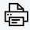

Reports Module
##############

The Reports module provides detailed analytical reports across attendance, finance, enrollment, staff, and academic performance. Navigate to **Reports** in the main menu to access the general reports dashboard. Additional module-specific reports are available within each respective module (e.g. Finance Reports are also accessible under Finance > View Payments).

.. note::

	Access to specific reports is controlled by user permissions. Your account administrator may restrict access to certain report types.

.. |edit_icon| image:: ../images/pencil.png

.. _reports_attendance:

Attendance
**********

Navigate to **Reports > Attendance** to generate student attendance reports.

Filter options:

* **Class**: restrict to a specific class
* **Date Range**: from and to dates
* **Term**: restrict to an academic term
* **Period**: daily, weekly, monthly, or termly summary

The attendance report shows each student's total school days, days present, days absent, and attendance percentage. The class-level summary shows overall attendance for the class.

Click **Print** (|print_icon|) to generate a printable attendance report.

.. tip::

	A student's individual attendance history can also be viewed from their student details page under the Attendance tab.

.. _reports_finance:

Finance
*******

Finance reports are accessible from **Reports > Finance** or from within the Finance module.

.. _reports_finance_payments:

Payments
========

The Payments report shows all fee payments recorded within a selected period.

Filter by:

* Date range
* Class
* Campus
* Payment type (cash, cheque, mobile money, bank transfer)

The report shows the student name, class, amount paid, payment date, receipt number, and recording staff member. Click **Print** to export a printable payments summary.

Expected Revenue
================

Navigate to **Reports > Expected Revenue** to see the total amount billed vs. total paid for any class or year group, with the outstanding balance. Filter by class, campus, section, or division. Useful for tracking collection performance at the end of a term.

Debtors Report
==============

The Debtors report (also accessible from **Finance > Debtors List**) shows all students with outstanding balances. Filter by class, campus, section, and amount paid threshold. The report shows each student's total bill, amount paid, and balance owed.

Non-Bill Payments Report
========================

Shows all payments recorded as non-billable items (e.g. PTA dues, activity fees not on the standard bill). Filter by date range and class.

Income & Expenditure Report
============================

Navigate to **Reports > Income & Expenditure** for a breakdown of all income (fee payments, non-bill payments) and expenditure recorded within a period. The report can be filtered by date range and broken down by week or month.

.. _reports_enrollment:

Enrollment
**********

Navigate to **Reports > Enrollment** for a statistical overview of student enrollment.

Available reports:

* **Total Enrollment**: total students by class, section, campus, or division
* **Gender Breakdown**: male/female split by class or across the school
* **Status Breakdown**: active, withdrawn, past students

Click **Print** to generate a printable enrollment statistics report, which includes school details and logo.

.. _reports_activity_log:

Activity Log
*************

Navigate to **Reports > Activity Log** to view a complete audit trail of all user actions in sERP.

The log records:

* User who performed the action
* Action type (e.g. Added Student, Recorded Payment, Modified Class)
* Date and time
* Relevant record (e.g. student ID, payment reference)

Filter by user, action type, or date range. This report is typically restricted to administrator-level users.

.. _reports_staff:

Staff Reports
*************

Navigate to **Reports > Staff** to access staff-related reports.

**Staff List Report**
=====================

A printable staff directory including name, staff ID, department, designation, and contact information. Filter by department or campus.

**Birthday Alerts**
===================

The dashboard displays upcoming staff birthdays. A dedicated birthday report lists all staff birthdays within a configurable period.

**Payroll Archive Report**
==========================

Access archived monthly payroll data from **HR > Staff Payroll**. Select any previous month to view or reprint the payroll report for that period.

.. _reports_teacher_performance:

Teacher Performance
*******************

Navigate to **Reports > Teacher Performance** to view an aggregated performance overview for all teaching staff.

The report calculates:

* **Assignments Posted**: total assignments created by the teacher
* **Submissions Received**: total student submissions received
* **Graded**: submissions that have been graded
* **Assignment Completion Rate**: percentage of expected submissions that were received (submissions ÷ expected, shown as a progress bar)
* **Average Feedback Score**: average rating from student and parent feedback, on a scale of 1–5

Only teachers with at least one assignment posted or at least one feedback rating are shown in this report.

.. _reports_disciplinary:

Disciplinary Report
*******************

Navigate to **Reports > Disciplinary Report** to view all disciplinary incidents recorded across the school.

Filter by:

* **Class**: restrict to incidents involving students in a particular class
* **Incident Type**: filter by the type of incident (e.g. misconduct, truancy)

The summary at the top shows the total number of incidents, number of open (unresolved) incidents, and number of resolved incidents.

The table lists each incident with the student name, class, date, incident type, description, action taken, and resolution status.
