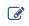

Settings & Configuration
########################

sERP has many options which control how the software operates. This section details the setup and configuration options available.

.. _settings_general:

General Settings
****************

1. From the :ref:`welcome menu <setup_layout>`, click on "Settings"
2. From the "General Settings" section, click on any wrench (|wrench_icon|) icon on the right section of the page
3. Enter the following details:

	* **School Emblem**: Click the camera icon to upload a JPEG image (*under 400px*) representing your school's logo. After selecting the file, a crop overlay will appear — draw a selection box around the area you wish to use and click **Crop Image** to confirm.

	* **School Name**: Enter your school name as you wish it to appear throughout the sERP, including on printed documents

	* **School SubName**: Whatever you enter here will appear on a different line next to your school's name in smaller text in both on-screen and printed documents

	* **Motto**: Enter your school motto or slogan

	* **Email Address**: This is the default email address that will appear on all printed documents, and will also appear as the sender on all email correspondences

	* **Address**: Enter your school P.O. Box or Ghana Post Digital address

	* **Phone Number(s)**: Enter your school contact numbers. Multiple numbers may be entered, seperated by a comma

	* **Tax Identification Number (TIN)**: Enter your school tax identifiction number (TIN)

4. Click the "Save" button after entering the above information.

.. _settings_student_prefix:

Student ID Prefix
=================

1. From the general settings page, click the wrench (|wrench_icon|) icon next to "Student ID Prefix"
2. In the "Student ID Prefix", enter the value you wish to use as the student ID prefix
3. Click "Save"

.. _settings_staff_prefix:

Staff ID Prefix
===============

1. From the general settings page, click the wrench (|wrench_icon|) icon next to "Staff ID Prefix"
2. In the "Staff ID Prefix", enter the value you wish to use as the staff ID prefix
3. Click "Save"

.

.

.. _settings_student:

Student Settings
****************

1. From the :ref:`welcome menu <setup_layout>`, click on "Settings"
2. Click on  "Student Settings"

Scholarships
============

Displays the number of scholarships defined in the system. Click on the wrench icon (|wrench_icon|) to view and manage scholarships.

.. tip::
	Checkout our :ref:`student_scholarships` guide for more information

Campuses
========

Displays the number of campuses defined in the system. Click on the wrench icon (|wrench_icon|) to view and manage campuses.

.. tip::
	Checkout our :ref:`student_campuses` guide for more information

Dormitories
===========

Displays the number of dormitories defined in the system. Click on the wrench icon (|wrench_icon|) to view and manage dormitories.

.. tip::
	Checkout our :ref:`student_dormitories` guide for more information

.

.

.. _settings_academic:

Academic Settings
*****************

1. From the :ref:`welcome menu <setup_layout>`, click on "Settings"
2. Click on  "Academic Settings"

.. _settings_calendar:

Academic Calendar Management
=============================

From the Academic Settings section, click on the wrench (|wrench_icon|) icon to the right of "Default Academic Year / Term".

This opens the **Academic Calendar Management** page, which combines entry management and activation in one place. The page shows:

* An **Add Calendar Entry** form on the left
* The **Active Calendars** status panel and **All Entries** table on the right

.. _settings_calendar_add:

**Adding a new calendar entry**

1. In the "Add Calendar Entry" form, enter the following:

	* **Academic Year**: select the start and end years (e.g. 2025 / 2026)
	* **Label**: (optional) a name to identify this entry. Defaults to "Default" if left blank
	* **Category**: select Trimester or Semester
	* **Term/Semester**: select First, Second, or Third
	* **Begins**: select the term/semester start date
	* **Ends**: select the term/semester end date

2. Click "Add Entry". The new entry appears immediately in the "All Entries" table.

.. _settings_calendar_activate:

**Activating a calendar entry**

The **Active Calendars** panel shows which entry is currently active for each category (Trimester and Semester). To change the active entry:

1. Locate the entry in the "All Entries" table
2. Click the **Activate** button on that row

The entry becomes active immediately — the Active Calendars panel updates and the row is highlighted in green. Active rows do not show an Activate button.

.. note::
	You can maintain entries for multiple academic years and switch between them as the term changes. Only one entry per category (Trimester / Semester) can be active at a time.

.. _settings_calendar_delete:

**Deleting a calendar entry**

1. Locate the entry in the "All Entries" table
2. Click the delete (|delete_icon|) button on that row
3. Confirm the deletion

.. warning::
	* Deleting an entry is irreversible.
	* You cannot delete an entry that is currently active. Activate a different entry first, then delete the previous one.
	* The delete button is only visible to administrators.

.. _settings_divisions:

Divisions
=========

This displays the number of divisions currently configured in sERP. Click on the wrench (|wrench_icon|) icon to manage divisions.

.. tip::
	Check out our :ref:`academic_divisions` guide for more information

.. _settings_classes:

Classes
=======

This displays the number of classes currently configured in sERP. Click on the wrench (|wrench_icon|) icon to manage classes.

.. tip::
	Check out our :ref:`academic_classes` guide for more information

.. _settings_subjects:

Subjects
========

This displays the number of subjects currently configured in sERP. Click on the wrench (|wrench_icon|) icon to manage subjects.

.. tip::
	Check out our :ref:`academic_subjects` guide for more information

.. _settings_events:

Event Types
===========

This displays the number of event types currently configured in sERP. Click on the wrench (|wrench_icon|) icon to manage calendar.

.. tip::
	Check out our :ref:`Events Calendar <academic_calendar>` guide for more information

.. _settings_sba:

SBA Configuration
=================

SBA configuration determines the grading and comments criteria to be used in student performance assessments. At least one SBA configuration must be configured in order to use sERP, and each class has to be assigned an SBA configuration.

The SBA configuration section can be accessed from the academic settings page by clicking on the wrench icon (|wrench_icon|) next to SBA Configuration.

**Adding a new Configuration**

1. From the "Existing Configurations" pane, click on "Add New SBA Configuration" (**+**)
2. Enter the following information:

	* **Configuration Name**: a value to identify the new configuration
	* **No. of Class Work Columns**: the number of classworks given as part of student assessment within a term/semester. sERP supports a minumum of 4 and maximum of 8 classworks
	* **Class A{N} Max. Score**: the maximum attainable marks for each classwork defined above
	* **Classwork Scale %**: the percentage value that the sum of all classworks will be scaled to
	* **Exam Scale %**: the percentage value that the total exam score will be scaled to for assessment
	* **Grade Type**: select the GES format for grading and remarks to be used with this SBA configuration

3. Click on "Submit"

.. _settings_custom_grading:

Custom Grading Scales
=====================

sERP ships with three built-in grading scales — ``bece``, ``wassce``, and ``primary`` — whose grade boundaries and remarks are stored in the database and can be edited through this interface. Changes take effect immediately on all terminal reports that use the corresponding Grade Type.

The custom grading section can be accessed from the Academic Settings page by clicking on the wrench (|wrench_icon|) icon next to **Custom Grading Scales**.

.. note::

	The scale name is the key that links a scale to a class's Grade Type. Scales named ``bece``, ``wassce``, or ``primary`` (case-insensitive) override the corresponding built-in defaults. Additional scales with custom names can also be created for other purposes.

**Creating a new grading scale**

1. From the "Grading Scales" pane, enter a name in the box next to "Scale Name"
2. Optionally, check "Set as default" to mark this scale as the default
3. Click "Create Scale"

**Adding grade bands to a scale**

1. From the "Grading Scales" list, click on the name of the scale you wish to configure
2. From the entry form, enter the following:

	* **Grade**: the grade value (e.g. A, B, 1, A1)
	* **Label**: a short label for the grade (e.g. Excellent)
	* **Min %**: the minimum score (inclusive) for this grade band
	* **Max %**: the maximum score (inclusive) for this grade band
	* **Remark**: an optional remark displayed on progress reports for this grade

3. Click "Add Entry"

**Deleting a grade band**

From the entries table, click the delete (|delete_icon|) button for the entry you wish to remove and confirm.

**Deleting a grading scale**

From the scales list, click the delete (|delete_icon|) button for the scale you wish to remove. This will also delete all its grade band entries.

.. warning::
	Deleting a grading scale is irreversible. Deleting a built-in scale (bece, wassce, or primary) will cause the system to fall back to the hard-coded defaults for that grade type.

.. _settings_miscellaneous:

Miscellaneous Settings
======================

The following options can be toggled:

	* **Display student photo on terminal report?**: whether or not to display students' photos on progress reports. This requires that a photo has been uploaded for the student.
	* **Display attendance on terminal report?**: whether or not to display students' attendance on progress reports. Attendance will only be displayed if recorded using the :ref:`attendance module <student_attendance>`.
	* **Show student aggregate on terminal report?**: whether or not to display students' aggregate on progress reports. If set to yes, an entry box will be provided on student progress report to :ref:`record aggregate score <academic_report_data>`.
	* **Show subject positions on terminal report?**: whether or not to display students' subject positions on progress reports
	* **Show class/overall positions on terminal report?**: whether or not to display students' class position on terminal report

.

.

.. _settings_hr:

HR Settings
***********

1. From the :ref:`welcome menu <setup_layout>`, click on "Settings"
2. Click on  "HR Settings"

Departments
===========

This displays the number of departments currently configured in sERP. Click on the wrench (|wrench_icon|) icon to manage departments.

.. tip::
	Check out our :ref:`hr_departments` guide for more information

Staff Types
===========

This displays the number of staff positions/designations currently configured in sERP. Click on the wrench (|wrench_icon|) icon to manage staff positions/designations.

**Adding a new staff type**

1. From the "Add Staff Grade/Post", enter the staff position/designation in the box next to "Staff Grade/Post"
2. Click "Add Staff Type"

Income Tax Rates
================

Indicates whether or not tax rates have been configured. Tax rates are used in computing income tax (PAYE) as per Ghana Revenue Authority requirements. Click on the wrench (|wrench_icon|) icon to manage income tax rates.

**Viewing current tax rates**

The "Current Tax rates" pane displays the tax rates as presently configured in sERP.

**Updating tax rates**

Income tax rates are periodically ammended and published on the GRA website: https://gra.gov.gh/

To update tax rates:

1. Obtain the "monthly" tax rates from the GRA website, for example: https://gra.gov.gh/new-tax-rates-effective-1st-january-2020-2/
2. Enter the "CHARGEABLE INCOME" (amount only) and "TAX RATES" into the boxes provided
3. Click "Save"

Employer's File No./Social Security
===================================

Indicates whether or not the employer's SSNIT number has been set. Click on the wrench (|wrench_icon|) icon to manage.

To set the SSNIT number:

1. From the "Set File No. / Social Security" pane, enter your (school's) SSNIT number in the box next to "File No. / Social Security"
2. Click "Save"

Employee Contribution Rate
==========================

Indicates whether or not the employee contribution rate has been set. This defaults to 5.5%, and typically wouldn't need to be changed. Click on the wrench (|wrench_icon|) icon to manage.

To set employee contribution rate:

1. From the "Set Employee Contribution Rate", enter the contribution rate in the box next to "New Rate"
2. Click "Save"

SSNIT Remittance (1st Teir) Rate
================================

Indicates whether or not the SSNIT contribution rate has been set. This defaults to 13.5%, and typically wouldn't need to be changed. Click on the wrench (|wrench_icon|) icon to manage.

To set SSNIT contribution rate:

1. From the "Set SSNIT Remittance Rate", enter the contribution rate in the box next to "New Rate"
2. Click "Save"

Trustee Remittance (2nd Tier) Rate
==================================

Indicates whether or not the Trustee contribution rate has been set. This defaults to 5.5%, and typically wouldn't need to be changed. Click on the wrench (|wrench_icon|) icon to manage.

To set Trustee contribution rate:

1. From the "Set Trustee Remittance (2nd Tier) Rate", enter the following:

	* **Name Of Trustee**: name of your National Insurance Trust institution
	* **New Rate**: new value for Trustee contribution rate

2. Click "Save"

.

.

.. _settings_finance:

Finance Settings
****************

1. From the :ref:`welcome menu <setup_layout>`, click on "Settings"
2. Click on "Finance Settings"

.. _settings_fee_items:

Fee Items
=========

Fee items basically represent the items listed on a student's bill, for which an amount will be billed based on the :ref:`configured fees <finance_set_fees>` for that item. Click on the wrench (|wrench_icon|) icon to manage billable items.

**Adding a new fee item**

1. From the "Add Fee Item" pane, enter the name of the item you wish to add

	.. tip::
		You can add multiple items at a go by clicking on the (**+**) icon

2. Click "Add"

**Deleting a fee item**

1. From the "Registered Fee Items" pane, click on delete (|delete_icon|) in the action column for the item
2. From the confirmation dialog box, click to confirm the deletion

.. warning::
	Deleting data is an irreversible process

.. _settings_fee_categories:

Fee Categories
==============

sERP includes a feature that allows for segregated billing. By default, registered students are billed for all :ref:`fee items <settings_fee_items>`; however, using fee categories, you can exempt certain groups of students from being billed (and consequently paying) for specific billable items.

Click on the wrench (|wrench_icon|) icon to manage fee categories.

**Adding a new fee category**

From the "Add Category" pane:

1. Enter a name of the category in the box next to "Category Name"
2. Under "Fee Items", select the applicable fee items for the fee category
3. Click "Add"

.. note::
	* Students assigned to a fee category would only ever be billed for the items you select here
	* Students would explicitly have to be assigned to a fee category in order for their bills to be affected by it.

**Deleting a fee category**

1. From the "Registered Fee Items" pane, click on delete (|delete_icon|) in the action column for the item
2. From the confirmation dialog box, click to confirm the deletion

.. warning::
	Deleting data is an irreversible process

** Assigning a fee category to a student**

Fee categories can be assigned to a student either during student registration or by editing the student's details after registration. See our :ref:`student_registration` and :ref:`student_details` guides for more information.

Billing Footnotes
==================

Footnotes can be included on student's bills for the purpose of conveying specific information to parents, for example: payment schedule, term/semester reopening dates, etc. Click on the wrench (|wrench_icon|) icon to manage billing footnotes.

**Adding footnotes**

1. Enter up to 5 footnotes in the boxes provided next to "Footnote {N}"
2. Click "Save"

.

.

.. _settings_sms:

SMS Settings
************

1. From the :ref:`welcome menu <setup_layout>`, click on "Settings"
2. Click on "SMS Settings"
3. Here, you can setup the following:

	* **SMS API ID**: enter your D-Tech SMS API ID
	* **SMS API Key**: enter your D-Tech SMS API Key
	* **Send payment confirmation to parent?**: toggle to determine whether or not sERP sends payment notification to parent/guardian each time payment is applied to student bill
	* **Send absence notification to parent?**: toggle to determine whether or not sERP sends notification to parent/guardian when their ward is marked absent
	* **Default Sender ID**: this is the default value that will appear as the sender of all automated SMS notifications. "SchoolERPGH" will be used as the sender ID if not specified

Setting the API ID and Key
==========================

1. Click the wrench (|wrench_icon|) icon next to "API ID" as per above
2. Enter your API User ID and API in the relevant boxes provided
3. Click "Save"

.. tip::
	**Locating your SMS API details**:

	1. Create a D-Tech SMS account, if you haven't already done so: https://dtechghana.com/sms/app/signup
	2. Log in to the SMS dashboard at https://dtechghana.com/sms/app/login
	3. From the navigation menu, go to "API" -> "API Access" to obtain User ID and API Key

.. _settings_export:

Export Data
***********

1. From the :ref:`welcome menu <setup_layout>`, click on "Settings"
2. Click on "Export Data"

.. note::
	The Export Data page is only accessible to administrators.

This page allows you to download school data as CSV files. Select one or more datasets from the list and click **Export Selected**:

* **Students** — student records including personal details, guardian contacts, and account status. Optional filters:

	* *Filter by Class*: restrict the export to a specific class
	* *Status*: export active students only, withdrawn students only, or all

* **Staff** — all active staff records including personal details, department, employment type, and salary information

* **Classes** — class list with active and withdrawn student counts per class

* **Fee Payments** — all recorded fee payments with receipt numbers and payment dates. Optional filters:

	* *Term*: restrict to a specific term or semester
	* *Academic Year*: restrict to a specific academic year

Selecting a single dataset downloads a ``.csv`` file directly. Selecting multiple datasets downloads a ``.zip`` archive containing one CSV file per dataset.

.. note::
	* All CSV files are UTF-8 encoded with a BOM for Excel compatibility
	* Dates are exported in ``YYYY-MM-DD`` format
	* Export actions are recorded in the activity log

.

.

